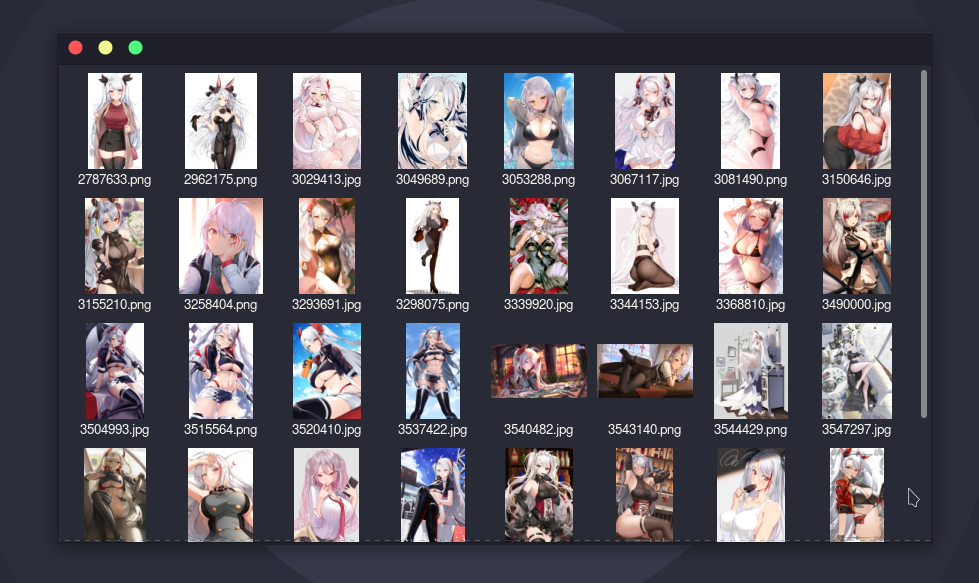

# Simple python image scraping script for zerochan

Zerochan is an image sharing platform focused on anime, manga, video games and fan art. 

This script downloads images for anything that's related to the topics mentioned above, it's highly simple and can easily be modified to be used as a module.

Usage:

```css
python scraper.py
Please type what you are looking for
> prinz
1. Prinz Eugen
2. Prinz Eugen (Kantai Collection)
3. Prinz Eugen (Default)
4. Prinz Heinrich
5. Prinz Des Dornes (Character)
6. Prinz Rupprecht (Azur Lane)
7. Prinz Adalbert (Azur Lane)
8. Prinz Eugen (Kantai Collection) (Cosplay)
9. PrinzKuon
10. Prinz Eugen (Azur Lane) (Cosplay)
11. Aoba (Sakura-hime Kaden)
12. Nagisa Prinzessin
13. Prince Philipp
> 1
Selected Prinz Eugen
Collecting page information now.
```

You can also just paste in the url if you browsed from browser and found a theme you like. For example you can just paste in ``https://www.zerochan.net/Prinz+Eugen?q=Prinz+Eugen`` when you run the script and it's just going to start from there.

Everything that gets downloading is stored in ``images`` directory

Preview of saved images

